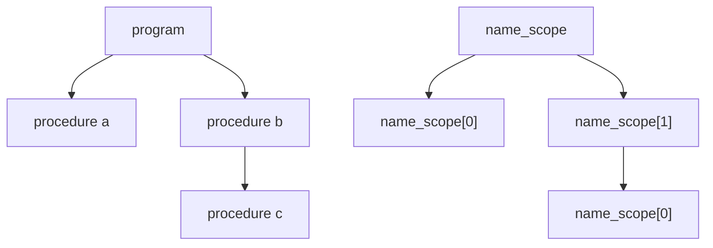
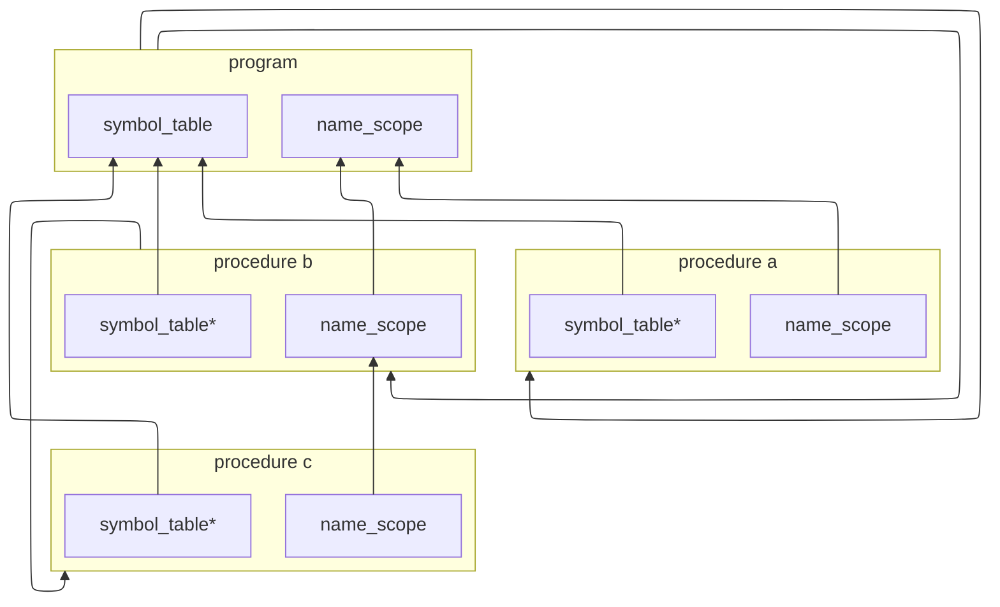

Hiiiyaaa~. Long time no see bitches. Your favourite
maximum cringe bestie Rae is here~~~~.

Ahem.

I apologize. I suck at expositions. 

Anyway. I haven't posted anything in quite a long while.
Not because I was embarassed about my cringe ass writing style,
but because I have no clue what to write about. 

I tried making posts, there are even like 3 drafts, but the more I write 
the more I go off the rails, the more the point of the post becomes moot.

My first 2 posts, despite being painful to read, were laser-focused 
onto the topic, explored it, and arrived at the conclusion. Bad 
conclusions, but conclusions nonetheless.

What am I getting at? I decided to embrace mootness and created a 
category for it --- Monthly Dev Post(MDP).
## Prequel

So for those of you who are unaware(how dare you not know everything about me), 
I am in the process of writing a compiler because I want to know
more about them. I am not using flex/bison for the frontend, and I plan
to write the entirety of the backend myself -- no llvm basically.

Stoopid idea. It is even more stoopid because this is my first compiler 
and I read like one book, which is NOTHING as it turns out. Basically,
I am writing a compiler completely blind.

### The phantom AST

As you have guessed, chapter names are based on original and prequel 
star wars trilogies. Tho, names aren't as creative as I initially hoped.

AST is a tree structure that describes our program. That's all I know about it.
For all the hundreds of pages of compiler design in the books,
actual description of the design is way too fucking vague.

Web doesn't have much as well besides the same example over and over. 
Here it is:
```c
// didn't test if this code even compiles 
// but the vibe of the ast is there 
struct expression;
struct binary_expression {
    enum operation {add, sub,} op;
    expression* lhs;
    expression* rhs;
};
struct expression {
    union {
        binary_expression bin_exp;
        int num;
    } data;
    enum { bin_op, number } kind; 
};
```
Which is less helpful than you guys think. THIS EXAMPLE TELLS NOTHING 
AT ALL. Do you think I can't come up with this shit if you told me 
that I need a tree structure? 

Argh. Whatever. Let's talk about symbol table. 

### Attack of the symbols

For all my lamenting about textbooks, this one time they explain
symbol table and its structure a bit better. Not much tho.

```cpp
// example 1
auto func1() {
    int a,b;
    a + b;
}
// example 2
auto func2() {
    a + b; // error: poopoo
    int a,b;
}
```
The first example is fine, and the second one errors out.
Compiler keeps track of identifiers: which are occupied,
which are not, what they mean etc.

How does the compiler do that? 

Symbol table.

When a declaration is encountered, it adds respective identifier 
to the table.

Simple, right? Textbooks also describe how to structure it so that 
it would be efficient and allow scoping. That's good and all 
, but... what the hell am I supposed to do with it?

Like where do I fit this shit in? Where do I store it? What should
I store in it? How does it interact with AST? 

I am so fucking lost. 

At least I pretty quickly came up with the things I do store in there.

```
declaration like this:
    var 
        a,b: Integer;
would be first mapped to integers in the first data structure

    ["a", 0], ["b", 1]

and then integers would be mapped to declarations in the second
data structure
(it is basically an array of declarations) 
[0, [name: "a", type: Integer]], [1, [name: "b", type: Integer]]
```
Why such a roundabout way? It is simpler to work with an array. 

The first data structure is only responsible for scoping pretty much.

Now, once again, where do I shove it? Or more specifically, 
what does it have to do with AST?

### Revenge of the coupling

...

I don't know how to start describing the problem since I don't know 
what the problem is. 

Basically, AST and symbol table have to interact _somehow_, but how 
closely -- fuck if I know. 

The baseline is: AST has to make use of the integers from the symbol table.
Those integers that are mapped to names.
```cpp
namespace ast {
struct variable_identifier {
    variable_id id;
};
struct type_identifier {
    type_id id;
};
}
```
It is more efficient than storing a string. If you need a name, you 
can use id to access a name via symbol table. Less memory, faster lookups,
there is simply no reason not to do it this way. The only downside
is that we have to bundle up symbol table with AST. 

## Main trilogy 

Hereinafter are my pathetic attempts at designing something... useable?

Also, what I called symbol table in this post, in my code is called 
`semantic_context`. Here is a very simplified structure: 
```cpp
struct symbol_table {
    std::vector<int> m_declaration;
};
struct name_scope {
    // the exact structure of it 
    // will be revealed later
};
struct semantic_context {
    symbol_table* m_table;
    name_scope*   m_names;
};
```

### False hope 

At first, I thought that I should shove it into the `parser` class,
but alas, none shall take the throne. 

I can't stop saying this phrase any time I use the word "alas". 
It is so stupid. Even I don't find it funny anymore... Ok, it is a
little bit funny to me.

STOP DERAILING. 

So what about storing it in the parser? 

It is a very tempting option. 

Its main appeal is that context is built during parsing, as well as 
used by the parser itself to build an AST. So the natural conclusion 
is: "symbol table is part of the parser state". 

Which, now that I say it out loud, sounds like a very stupid conclusion. 

The first problem that arises is. When we finish parsing, what do we 
do with the context? It would be good to yoink it from the parser state. 
We can do it like that: 
```cpp
class parser {
public:
    // a lot of good code hopefully
    auto pluck_out_context()
        -> semantic_context&& {
        return std::move(m_ctx);
    }
private: 
    //some members
    semantic_context m_ctx;
};
```
I mean it works. Not like extracting it was a problem. 
The real problem is where to extract it. 

We obviously need it, and we need it in close proximity to the AST.
The most obvious solution is to just squash them together.
```cpp
struct blobed_ast {
    handle<program> head;
    semantic_context ctx;
};
```
Well, it is one solution for sure. 

To sum up. We parsed a program, along the way, constructed ast and 
its context, and then tied them together.

Up to here there are no problems. But... 

### Repetition strikes back 
Let's look at this illustrative pascal program 

> Yes, I am writing a pascal compiler. Yes, I am a coward. So what?
{: .prompt-info}

```pascal 
program example;
procedure a();
begin end;
procedure b();
    procedure c();
    begin end;
begin end;
```
And now let's look at this.

Left --- our ast structure. Right --- our name_scope structure.

Don't they look similar?
Of course they do. Because they describe the same thing, the only 
thing that differs is the data they store. 

So... why not, you know? Merge them? Make AST store `semantic_context`.
It will simplify a lot of things.
Like, right now our `name_scope` stores this:
```cpp
struct name_scope {
    std::vector<name_scope*> m_children;
    // ignore this member. It isn't important now.
    // std::unordered_map<std::string, int> m_names;
    name_scope* m_parent;
};
```
But since we can reuse links inside the ast we can remove
`m_children` member. Yay.

`m_parent` member is off-limits tho. We need it since parent scope 
names are accessible from the child scope.

But aren't I forgetting something? Ah yes.

### Return of the `symbol_table`

As was shown earlier, `semantic_context` has 2 members:
one is the `name_scope`, and the other is `symbol_table`.

I glossed over it for the simple reason. I didn't put much thought 
in this post!

That easy!

But also, there isn't much to say about it.

It is a dumb array of declarations. It is just that. Nothing more to it. 

What IS interesting is how it is stored in the `semantic_context`.

Now we already know that `name_scope` is created for every new scope 
in the AST, and it has a pointer to the parent scope, creating a reverse tree 
of some sort. 

`symbol_table` behaves completely differently. When a new scope 
appears it takes a pointer to THE one `symbol_table`, the one we should
have been allocated at the very beginning.

And that's about it. Oh, and btw, I made a mermaid diagram to show 
how the end result should look like, but it turned out pretty 
confusing. Anyway, enjoy the ugly graph!



## Encore 

Now, I could have continued the bit with the star wars, and used 
sequel trilogy names... BUT I like to pretend that it doesn't exist.

Also, it is kind of a tradition to have the "Encore" section in my 
posts. So... it is a no-brainer for me.

So what goes in here? 

OOO baby, good news. My inner c++ gremlin has AWAKENED ONCE AGAIN.

Well, to be honest, not as much as it used to. But still, it will be 
a little fun. So prepare for a healthy dose of disgusting code. 

### The problem 

It comes directly from the stuff I talked about right before a diagram.

Yes, `symbol_table` and its ownership.

```cpp
// reminder how it looks 
struct semantic_context {
    std::unique_ptr<name_scope> m_names;
    symbol_table* m_table;
};
```
As I said before --- All `symbol_table` pointers point to THE ONE 
`symbol_table`. It means that it should be allocated only once at 
the global scope, everything else should just take a pointer to it. 

That is a silly problem. Here are like 5(3) solutions 

```cpp
// 1.
// create it in the top ast node
struct program {
    symbol_table table;
};
// 2.
// make a special context with owning pointer
struct global_context {
    std::unique_ptr<name_scope> m_names;
    std::unique_ptr<symbol_table> m_table;
};
// 3.
// or just make it shared_ptr lmao
struct semantic_context {
    std::unique_ptr<name_scope> m_names;
    std::shared_ptr<symbol_table> m_table;
};
```
Any of those is fine. Albeit, all of them have annoying things.

The second one has a downside of introducing a duplicate of the 
`semantic_context` class, and let me tell you, it is not a small 
class. Also, implementing their interaction is too much work.

The third one is an overkill. `shared_ptr` has an atomic reference count,
we don't need it, conceptually we have only one owner, and all 
other non-global scopes only interact with THE ONE `symbol_table`.

The first solution is... well, it is good. But it annoys me for some 
reason. I dunno.

Whatever. We are not here for the perfect solution, we are here for the 
deranged one.

### The deranged one 

Let's look at the solution number 3. As we said before, it is overkill.
But what if we made another smart pointer? The one that is tailor-made for our use case.

Its semantics are like this: 
 - there are two states of a pointer: owning and non-owning
 - on copy, you can make only non-owning one.
 - on move, you can transfer ownership from owning to non-owning one 
 - construction of the owning one is done via the factory function 
   `make_******`.
 - on destruction, only owning pointer is responsible for the cleanup

Quite clear. But before we go to implementing it, we should do the most 
important and difficult part --- _name it_.

I came up with these name options:

1. license_ptr - our owner gives out licenses for the use of the resource.
If I had to release this pointer as a library for the public(I would not,
this thing is quite useless), I would give it this name. Short, witty,
and you get the idea once you have a basic understanding.
2. glory_ptr - named after "glory hole". As long as the owner of the 
dick is there, you are free to suckle on it. But the owner can go 
away any moment, and you can't do much about it.
3. cuck_ptr - to understand the idea behind this name, we need to rethink
resource management. We need to stop thinking about it in terms of ownership,
but in terms of relationships. For example, `unique_ptr` --- commited 
relationship, where your partner is faithful to you, `shared_ptr` ---
swinger party, everyone has a go, until everyone is satisfied. 
Do you pick up what I am putting down? No? Tsk, some people just 
don't understand higher thought.
4. stupid_ptr - quite a dumb name, but an apt one. This pointer isn't 
really worthy to be called smart, and compared to other 
options in this list, this name isn't getting lost in analogies. 

Option 4 it is.

### Too fat?

Before we get to an actual Implementation, I want to go on a little tangent.

#### Crash course into alignment
`sizeof(struct{T*;})`? 
 - 8

`sizeof(struct{T*; bool;})`? 
  - 16 

Why? 
 - Alignment. 

What is alignment? 
 - It is how real physical memory is structured. 

How is it structured? 
 - In word lines. Word lines are stacked on top of each other when 
 we access something aligned, we read the entire word line at once. 
 Unaligned accesses have to make 2 accesses, because data is stretched 
 throughout 2 word lines.

> Not to confuse with windows's definition -- `WORD`. In reality, 
word is a unit of data cpu works in. On modern cpus it is 64 bit.
Hence word line size is 8 byte. Windows defines `WORD` as 16 bit 
for backwards compatibility.
{: .prompt-info}

If `struct` contents has data size larger than a half-word, then compiler 
forces it to occupy whole number of word lines.

That's why 
```cpp
template<typename T>
struct stupid_ptr {
    T* data; // 8 bytes
    bool is_owner; // 1 byte
};
```
Even though it has 9 bytes worth of data, it occupies 16 bytes. 

#### 7 useless bytes 
It is... a non-issue really. At least in my case. But I kind of 
want to work around it. Not for some valid reason, I just like 
the challenge.

So what can we do about it? The answer is alignment.

What are the consequences of data being aligned?

It means that the first few bits in the address are always 0. So we can hijack 
those bits for our data. In our case, we need just one bit. 

### Implementation 

This will be the core of our implementation.
```cpp
template<typename T>
class stupid_ptr {

    // first important operation. tagging an owner
    stupid_ptr(T* data) noexcept {
        m_tagged_ptr = reinterpret_cast<std::uintptr_t>(data);
        // shove bool value into the first bit
        m_tagged_ptr |= 1;
    }
    template<typename U>
    friend auto make_owner(auto&&...)
        -> stupid_ptr<U>;
public:
    // second. bool extraction 
    auto is_owner() const noexcept 
        -> bool { return m_tagged_ptr & 1; }
    // third. pointer extraction
    auto get() noexcept 
        -> T* { 
        return reinterpret_cast<T*>(m_tagged_ptr & ~1uz);
    }
    auto get() const noexcept 
        -> T const* { 
        return reinterpret_cast<T const*>(m_tagged_ptr & ~1uz);
    }
    // fourth. resource cleanup 
    ~stupid_ptr() {
        if (is_owner()) {
            delete get();
        }
    }
private:
    std::uintptr_t m_tagged_ptr;
};

template<typename T>
auto make_owner(auto&&... args)
    -> stupid_ptr<T> {
    return stupid_ptr(
        // new allocations are always aligned 
        // to __STDCPPW_DEFAULT_NEW_ALIGNMENT__
        new T(std::forward<delctype(args)>(args)...)
    );
}
```
Now, transfer of ownership via copy and move constructors.
```cpp
class stupid_ptr {
public:
    stupid_ptr(stupid_ptr const& other) noexcept {
        m_tagged_ptr = other.m_tagged_ptr;
        // copy is always non-owning
        m_tagged_ptr &= ~1uz;
    }
    stupid_ptr(stupid_ptr&& other) noexcept
        : m_tagged_ptr(other.m_tagged_ptr) {
        other.m_tagged_ptr = 0;
    }
    auto operator=(stupid_ptr const& other) noexcept
        -> stupid_ptr& {
        if (is_global()) {
            delete get();
        }
        m_tagged_ptr = other.m_tagged_ptr;
        m_tagged_ptr &= ~1uz;
    }
    auto operator=(stupid_ptr&& other) noexcept
        -> stupid_ptr& {
        if (is_global()) {
            delete get();
        }
        m_tagged_ptr = other.m_tagged_ptr;
        other.m_tagged_ptr = 0;
    }
};
```
And small ptr essentials.
```cpp
class stupid_ptr {
public:
    stupid_ptr(nullptr_t)
        : m_tagged_ptr(0) {}
    template<typename Self>
    auto operator*(this Self self) 
        -> delctype(auto) {
        // My pointer types are always checked
        if (self.m_tagged_ptr == 0) throw internal_error();
        return std::forward_like<Self>(*self.get());
    }
    template<typename Self>
    auto operator->(this Self self) {
        // internal error is just my exception type.
        if (self.m_tagged_ptr == 0) throw internal_error();
        return self.get();
    }
};
```

## Epilogue

In this post I talked about my conundrum. While it might seem 
that the solution I came up with is the most obvious thing in the world,
so obvious that there was no need to think at all,
don't forget --- I am stupid. It takes a lot of my brain power
to come up with the most obvious, the most simple solution 
known to men.

Oh, also that `stupid_ptr` of mine, is just an exercise in ugly.
I won't use it in reality... probably... I hope...

Whatever, If you read till the end. I hope you have a nice day.

Peace \/ 


